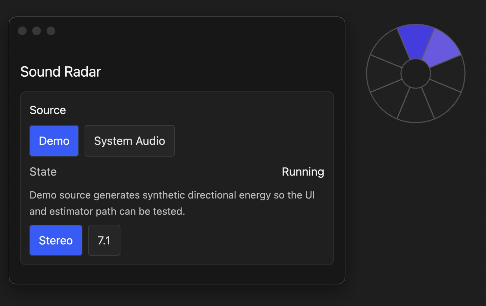

# Hear Ring

Hear Ring is a desktop app that turns audio input into a radar overlay.

## Preview

## Current features

- GPUI options and overlay windows
- demo and macOS system-audio sources
- stereo and 7.1 direction estimation
- tuning controls and runtime diagnostics
- draggable or click-through overlay modes

## Processing pipeline

Audio source -> `ChannelEnergies` -> estimator -> smoother -> overlay/UI

## Sources

### Demo
A synthetic source that moves energy around the ring so the full pipeline can be tested without real audio capture.

### System Audio
On macOS, the app can capture system audio through ScreenCaptureKit and feed the stereo analysis path.

## Running

Run the app with:

`cargo run`

## macOS permissions

ScreenCaptureKit-based system-audio capture requires **Screen Recording** permission for the host app you launch from, such as Terminal or iTerm.

Open:

`System Settings -> Privacy & Security -> Screen Recording`

Enable your terminal app, then restart it before launching the project again.

## Current limitations

- real system-audio capture is macOS-only
- real capture currently feeds the stereo path only
- automatic channel-layout discovery is not implemented
- multi-display overlay management is not implemented yet

## Status

Prototype, but the core runtime, estimation, and overlay are in place.

## Next likely work

- add Linux support
- add Windows support
- expand overlay behavior toward full multi-display support
- broaden real-capture direction handling beyond the stereo path
